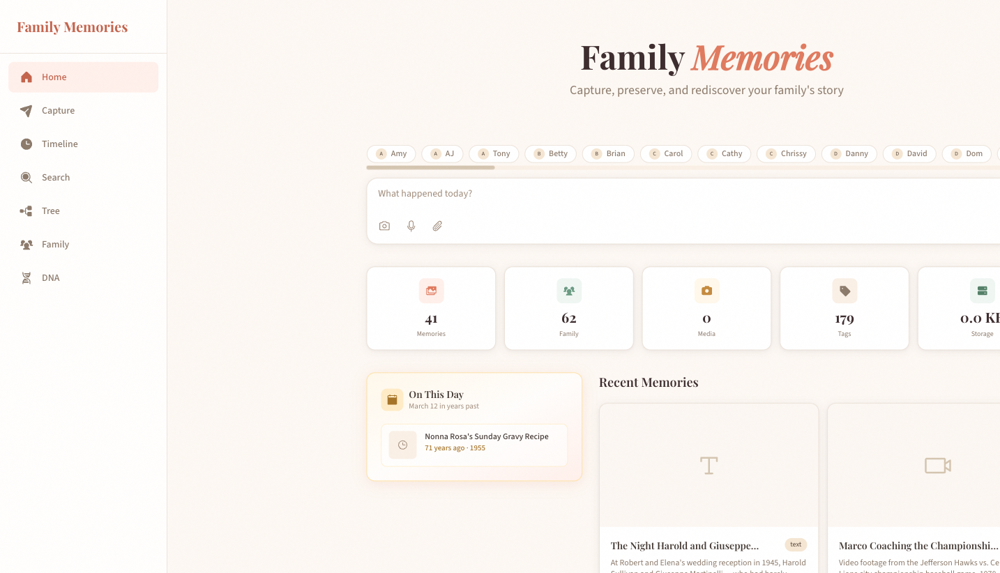
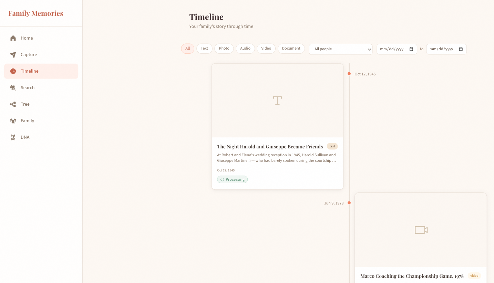
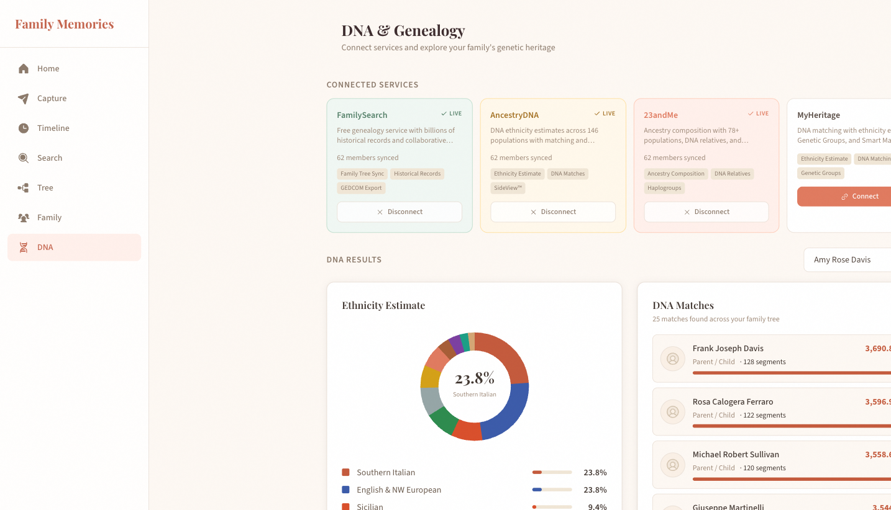
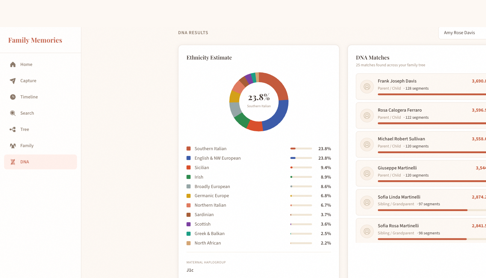
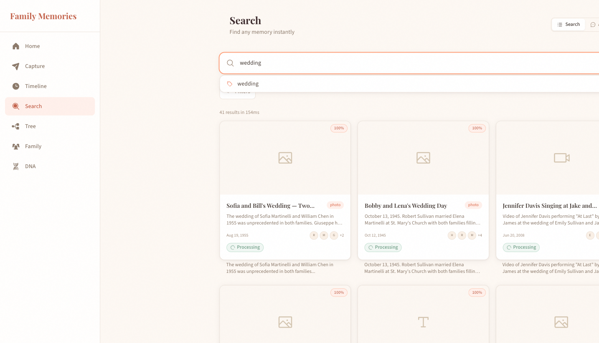
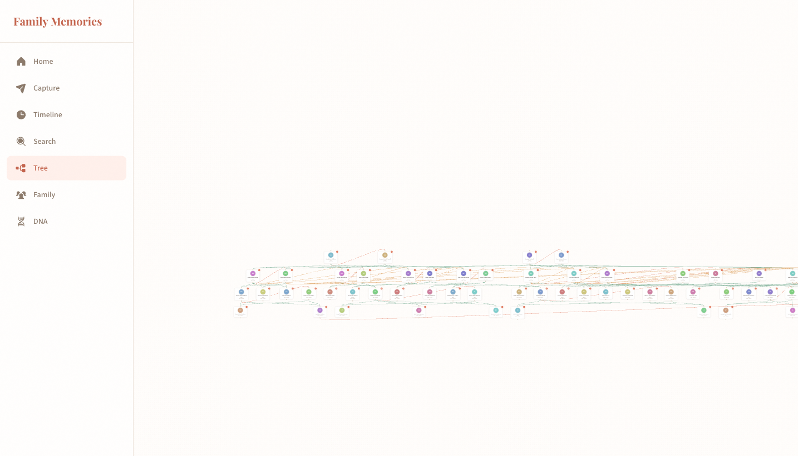

# Family Memories

A local-first web application for capturing, preserving, and rediscovering your family's story. Built with TypeScript, React, and AI-powered semantic search — designed to feel like a warm family photo album, not a developer dashboard.



## Why This Exists

Every family has stories that live only in someone's memory — the recipe Nonna never wrote down, the letter from the war, the way Grandpa laughed. This app captures those memories (text, photos, audio, video) and makes them searchable, connected, and explorable through an interactive family tree.

Unlike cloud-dependent services, Family Memories runs entirely on your machine. Your family's data never leaves your computer.

## Features

### Memory Capture & Storage
- **Quick capture** — text, photo, audio, and video memories with rich metadata
- **Auto-tagging** — AI extracts people, places, dates, and themes from your memories
- **Media processing** — automatic thumbnails, EXIF extraction, and format normalization
- **Story prompts** — curated prompts to help surface memories you haven't thought to record

### Semantic Search & RAG
- **Hybrid search** — combines vector similarity (LanceDB) with keyword matching, merged via Reciprocal Rank Fusion
- **Cross-encoder reranking** — `@xenova/transformers` reranks results for precision
- **Conversational search** — ask natural language questions ("What happened at the wedding?") and get RAG-generated answers with cited sources
- **Autocomplete** — real-time suggestions for tags and family members as you type

### Interactive Family Tree
- **Visual graph** — 62-member, 4-generation family tree rendered with `@xyflow/react`
- **Relationship management** — parent, spouse, and sibling relationships with visual edge styling
- **Person profiles** — individual pages showing bio, relationships, and linked memories
- **Graph algorithms** — `graphology` powers ancestor detection, generation computation, and shortest-path queries

### DNA & Genealogy Integration
- **Simulated service connections** — FamilySearch, AncestryDNA, 23andMe, MyHeritage
- **Ethnicity estimates** — dynamically computed from ancestry graph using surname-based root ethnicities with recursive 50/50 blending
- **DNA matching** — common ancestor detection + generation distance mapped to shared centiMorgans via Shared cM Project v4 data
- **GEDCOM 5.5.1 export** — standards-compliant export compatible with all major genealogy software (62 individuals, 18 families)

### Timeline & Discovery
- **Chronological timeline** — filterable by type, person, and date range with alternating card layout
- **"On This Day"** — surfaces memories from the same calendar date in previous years
- **Related memories** — AI-detected connections between memories based on semantic similarity



## Architecture

```
family-memories/
├── shared/          # TypeScript types & constants (shared between server + frontend)
├── server/          # Express + WebSocket backend
│   ├── routes/      # HTTP endpoints (memories, family, search, timeline, genealogy, health)
│   ├── services/    # Business logic (AI pipeline, graph, media, genealogy)
│   ├── db/          # SQLite migrations + LanceDB connection
│   └── jobs/        # Async processing queue (embed, summarize, extract, thumbnail)
├── frontend/        # React 19 + Vite SPA
│   ├── pages/       # 9 route pages
│   ├── components/  # UI components (capture, memory, family, search, genealogy, layout, shared)
│   ├── hooks/       # React Query hooks + WebSocket
│   ├── stores/      # Zustand state management
│   └── services/    # API client layer
└── data/            # Runtime data (gitignored): SQLite DB, LanceDB vectors, media files
```

### Tech Stack

| Layer | Technology |
|-------|-----------|
| **Language** | TypeScript (strict mode, ES modules) |
| **Server** | Express 4, WebSocket (`ws`), Helmet, CORS, rate limiting |
| **Database** | SQLite (`better-sqlite3`, WAL mode) — 11 tables |
| **Vectors** | LanceDB (embedded, 768-dim `nomic-embed-text` vectors) |
| **AI** | Ollama (`nomic-embed-text` for embeddings, `cx-intelligence-slm` for inference) |
| **Reranking** | `@xenova/transformers` cross-encoder |
| **Graph** | `graphology` (in-memory directed multigraph) + `@dagrejs/dagre` (layout) |
| **Caching** | Redis (localhost:6379) |
| **Frontend** | React 19, Vite, Tailwind CSS |
| **State** | Zustand (client state) + TanStack Query (server state) |
| **Tree Viz** | `@xyflow/react` with custom nodes and edges |
| **Animation** | Motion (Framer Motion) |
| **Icons** | Phosphor Icons |
| **Fonts** | Playfair Display (display) + Source Sans 3 (body) |

### Database Schema

11 SQLite tables with full relational integrity:

- `family_members` — people in the tree (name, birth/death dates, bio, photo, gender, generation)
- `relationships` — typed edges (parent, spouse, sibling) between members
- `memories` — core content (title, content, type, date, location, sentiment, processing status)
- `media_assets` — uploaded files with thumbnails and extracted metadata
- `tags` — categorized labels with AI confidence scores
- `memory_tags` / `memory_people` — many-to-many junction tables
- `entities` — extracted named entities (people, places, dates, organizations)
- `memory_connections` — AI-detected relationships between memories
- `job_queue` — SQLite-backed async processing queue
- `genealogy_services` — connection state for DNA/genealogy providers

### AI Pipeline

```
Capture → 201 Accepted → Job Queue
  ├── Thumbnail generation (sharp)
  ├── Text chunking (semantic boundaries)
  ├── Embedding (Ollama nomic-embed-text → LanceDB)
  ├── Summarization (Ollama cx-intelligence-slm)
  ├── Entity extraction (people, places, dates)
  ├── Auto-tagging (theme classification)
  └── Connection detection (cross-memory links)
       ↓ WebSocket push on each stage completion

Search → Query Parse → Embed → Vector + Keyword → RRF Merge → Rerank → Enrich → Present
```

## Screenshots

### Dashboard

*Quick capture bar, family member avatars, stats cards, "On This Day" feature, and recent memories grid*

### DNA & Genealogy

*Service connections, SVG ethnicity donut chart, and DNA match list with centiMorgan values*


*11-region ethnicity breakdown with percentage bars, haplogroup data, and match cards with relationship predictions*

### Search

*Hybrid search with autocomplete, relevance scores, people avatars, and type-filtered results*

### Family Tree

*Interactive 62-member, 4-generation family tree with zoom, pan, and minimap*

### Timeline

*Chronological view with type/person/date filters and alternating card layout*

## Getting Started

### Prerequisites

- **Node.js** 20+ (tested on 25.2.1)
- **Ollama** running locally with models pulled:
  ```bash
  ollama pull nomic-embed-text
  ollama pull cx-intelligence-slm    # or any Qwen2-based model
  ```
- **Redis** running on localhost:6379 (optional — used for caching)

### Installation

```bash
git clone https://github.com/chendren/family-memories.git
cd family-memories
npm install
```

### Running

```bash
# Start both server (port 3142) and frontend (port 5173)
npm run dev
```

Or run them separately:

```bash
# Terminal 1 — Backend
cd server && npm run dev

# Terminal 2 — Frontend
cd frontend && npm run dev
```

Open [http://localhost:5173](http://localhost:5173) in your browser.

### Seed Data

The project includes a 62-member Sullivan-Martinelli family spanning 4 generations (1898–2026) with 127 relationships and 41 richly detailed memories:

```bash
node seed.mjs
```

This creates a complete family tree with Irish, Italian, Chinese, and multi-ethnic members, plus memories covering weddings, holidays, career milestones, recipes, and everyday moments across 80+ years.

### Health Check

```bash
curl http://localhost:3142/api/health
```

Returns status of Ollama, SQLite, LanceDB, Redis, and available disk space.

## API Endpoints

### Memories
| Method | Path | Description |
|--------|------|-------------|
| `GET` | `/api/memories` | List memories (paginated, filterable by type/person/tag) |
| `POST` | `/api/memories` | Create memory (kicks off AI processing pipeline) |
| `GET` | `/api/memories/tags` | List all tags with memory counts |
| `GET` | `/api/memories/on-this-day` | Memories from this date in previous years |
| `GET` | `/api/memories/:id` | Memory detail with assets, tags, people, entities |
| `PUT` | `/api/memories/:id` | Update memory |
| `DELETE` | `/api/memories/:id` | Delete memory + cleanup vectors |
| `GET` | `/api/memories/:id/related` | AI-detected related memories |

### Search
| Method | Path | Description |
|--------|------|-------------|
| `POST` | `/api/search` | Hybrid semantic + keyword search with reranking |
| `POST` | `/api/search/conversational` | RAG-powered Q&A with cited sources |
| `GET` | `/api/search/suggest?q=` | Autocomplete suggestions (tags + people) |

### Family
| Method | Path | Description |
|--------|------|-------------|
| `GET` | `/api/family/members` | List all family members |
| `POST` | `/api/family/members` | Add family member |
| `GET` | `/api/family/members/:id` | Member detail with relationships + memories |
| `PUT` | `/api/family/members/:id` | Update member |
| `DELETE` | `/api/family/members/:id` | Delete member |
| `GET` | `/api/family/relationships` | List all relationships |
| `POST` | `/api/family/relationships` | Create relationship |
| `GET` | `/api/family/tree` | Full tree graph (nodes + edges) |

### Timeline
| Method | Path | Description |
|--------|------|-------------|
| `GET` | `/api/timeline` | Chronological memories (filterable) |

### Genealogy & DNA
| Method | Path | Description |
|--------|------|-------------|
| `GET` | `/api/genealogy/services` | List connected genealogy services |
| `POST` | `/api/genealogy/services/:provider/connect` | Connect a service |
| `POST` | `/api/genealogy/services/:provider/disconnect` | Disconnect a service |
| `GET` | `/api/genealogy/dna/:memberId` | DNA profile with ethnicity estimate |
| `GET` | `/api/genealogy/dna/:memberId/matches` | DNA matches sorted by shared cM |
| `GET` | `/api/genealogy/export/gedcom` | Download GEDCOM 5.5.1 file |
| `GET` | `/api/genealogy/export/gedcom/stats` | GEDCOM export statistics |

### WebSocket
Connect to `ws://localhost:3142/ws` for real-time processing status updates.

## Design

The frontend uses a warm, inviting aesthetic inspired by vintage family photo albums:

- **Palette**: Cream, sand, walnut, terracotta, sage, and gold
- **Typography**: Playfair Display (headings) + Source Sans 3 (body)
- **Cards**: Soft shadows, rounded corners, warm background textures
- **Motion**: Staggered page load animations, hover interactions via Motion
- **Icons**: Phosphor Icons (filled weight)

All custom colors are defined in `frontend/tailwind.config.cjs` with semantic naming (cream, sand, walnut, terracotta, sage, gold).

## Project Stats

| Metric | Value |
|--------|-------|
| TypeScript source files | 109 |
| Lines of code | ~10,500 |
| SQLite tables | 11 |
| API endpoints | 22 |
| Frontend pages | 9 |
| UI components | 30+ |
| React hooks | 8 |
| Seed family members | 62 |
| Seed relationships | 127 |
| Seed memories | 41 |
| Seed tags | 177 |

## License

MIT

---

Built with TypeScript, React, Ollama, and a deep appreciation for the stories that make families who they are.
